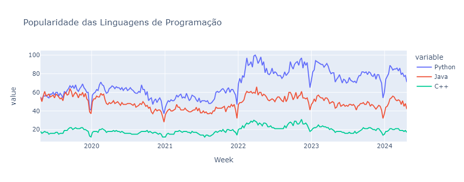
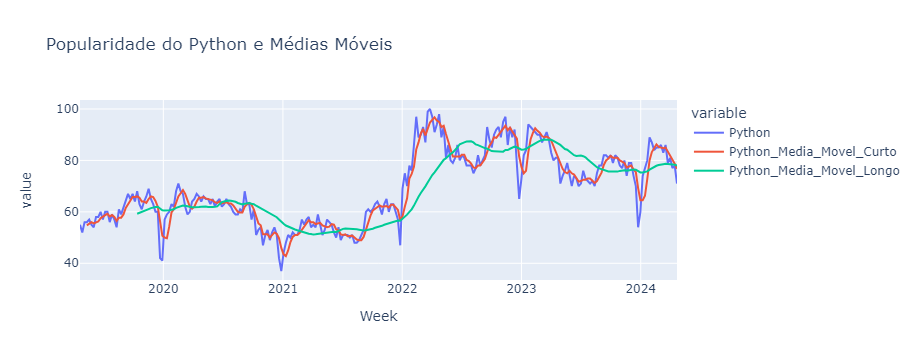

# Análise da Popularidade de Linguagens de Programação

Este relatório detalha a análise da popularidade das linguagens de programação Python, Java e C++ no período de abril de 2019 a abril de 2024. Utilizando dados semanais de popularidade, foram exploradas tendências temporais, padrões sazonais e mudanças de longo prazo.

## 1. **Evolução da Popularidade**

Os gráficos a seguir mostram a evolução da popularidade das linguagens de programação ao longo do período analisado.

## 2. **Padrões Sazonais**

Os gráficos mostram a média mensal de popularidade das linguagens, permitindo identificar padrões sazonais.

## 3. **Conclusões**

- **Tendências de Longo Prazo:** A análise revelou uma tendência de crescimento da popularidade de Python ao longo dos anos, enquanto Java e C++ mostram uma variação mais estável.
- **Padrões Sazonais:** Observou-se um aumento na popularidade de Python em determinadas épocas do ano, indicando possíveis padrões sazonais.
- **Popularidade Relativa:** Python foi a linguagem mais popular na maioria dos períodos, com Java e C++ mantendo uma posição relativamente estável.

## Instruções para Execução

1. **Instale as dependências**: `pip install pandas matplotlib seaborn plotly`
2. **Substitua o caminho do arquivo CSV** no script com o local do arquivo `trend_over_time.csv`.
3. **Execute o script Python**: `python analise_popularidade.py` para gerar gráficos e relatórios.

## Arquivos do Repositório

- `trend_over_time.csv`: Dados de popularidade das linguagens.
- `analise_popularidade.py`: Código Python para análise.
- `README.md`: Este arquivo de instruções e relatório.

---

Por favor, ajuste os gráficos e relatórios conforme necessário e adicione quaisquer observações adicionais relevantes para sua análise.
